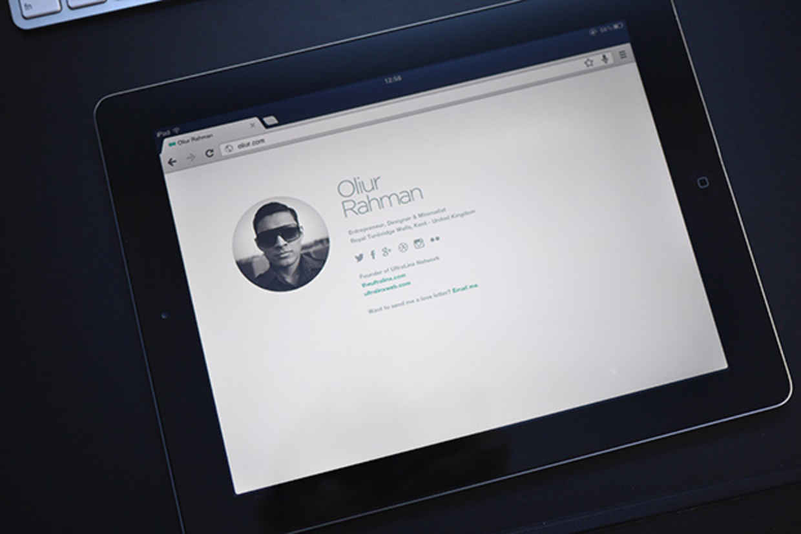
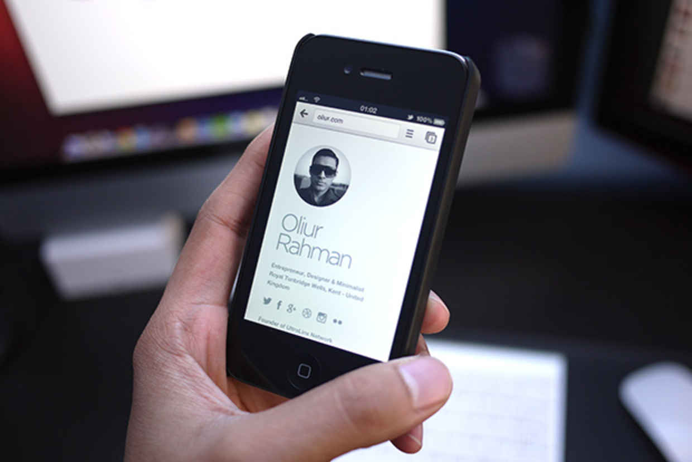

# Minimal Bio
A reponsive minimalalist bio HTML theme

*Note:  Based off of [MnmlBio](http://theultralinx.com/2012/09/minimal-bio-responsive-site-template-free-download/) by [Oliur](https://twitter.com/UltraLinx) at [UltraLinx Themes](http://themes.theultralinx.com/). Olier has [said that he wants nothing to do with the codebase any longer](https://twitter.com/UltraLinx/status/634503960775233540), So please direct any support requests to this repo's [Github Issues](https://github.com/therebelrobot/minimal-bio/issues)*

*from original post:*

> I redesigned my personal site a little - oliur.com - as you can tell, it's really minimal and concise. Some asked if I could share the template for my personal site and that's what I'm doing right now.
> 
> The template is completely adjustable and can be edited how you like. It of course includes the nice little CSS animation where the content flies down from above on to the screen. It's also completely responsive so it'll look great on mobile phones too.

## License

[ISC](https://tldrlegal.com/license/-isc-license)
